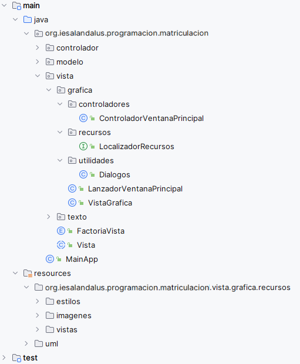

# SistemaMatriculacion-v5
# Profesor: Andrés Rubio del Río
# Alumno: 
Desde el IES Al-Ándalus nos acaban de dar unos nuevos requisitos a aplicar sobre la última versión que le mostramos y que les gustó bastante. Lo que nos piden es lo siguiente:

Quieren conservar la interfaz de texto de la aplicación.
Quieren agregar una nueva interfaz de usuario gráfica para ejecutar la aplicación.
Tu tarea consiste en dotar a la aplicación de la tarea anterior (con todas sus funcionalidades) de una interfaz gráfica de usuario utilizando JavaFX. La interfaz se puede diseñar al gusto de cada un@, pero deberá utilizar los componentes más adecuados en cada caso. Cuanto más elaborada esté, mayor será la calificación. Para ello debes emplear los diferentes tipos de controles, menús y contenedores que nos proporciona la API de JavaFX. Se pide al menos:

Un menú que nos permita salir de la aplicación, o acceder a las diferentes opciones sobre alumnos, asignaturas, ciclos formativos y matrículas.

La gestión de alumnos permitirá añadir uno nuevo, borrar uno ya existente y mostrar un listado con los siguientes datos como mínimo:
Nombre.
Dni.
Correo.
Teléfono de contacto.
Fecha de nacimiento.
Botón o menú contextual para eliminar a un determinado alumno.
Botón o menú contextual para acceder al listado de matrículas de un determinado alumno.

La gestión de ciclos formativos permitirá añadir uno nuevo, borrar uno ya existente y mostrar un listado con los siguientes datos como mínimo:
Código.
Nombre.
Grado.
Familia Profesional
Horas.
Botón o menú contextual para acceder al listado de matrículas de un determinado ciclo.
Botón o menú contextual para eliminar a un determinado ciclo formativo.

La gestión de asignaturas permitirá añadir una nueva, borrar una ya existente y mostrar un listado con los siguientes datos como mínimo:
Código.
Nombre.
Ciclo Formativo.
Curso.
Especialidad
Horas anuales.
Botón o menú contextual para eliminar a una asignatura.

La gestión de matrículas nos permitirá realizar una nueva matrícula y anular una matrícula ya hecha. También permitirá mostrar un listado con todos las matrículas con los siguientes datos:
Nombre y Dni del alumno.
Curso académico.
Listado de asignaturas (Nombre, Modalidad)
Botón o menú contextual para anular la matrícula (Si no ha sido ya anulada)
NOTA. Como mínimo, en el listado de alumnos, ciclos formativos y asignaturas, deberás implementar la funcionalidad de buscar y ordenar alfabéticamente (orden ascendente y descendente) por el nombre.

Por tanto, tu tarea va a consistir en usando como referencia el diagrama de clases proporcionado completar los apartados indicados a continuación:

Ilustración que muestra el diagrama de clases de la tarea

Debes crear un nuevo repositorio en Github llamado SistemaMatriculacion-v5. Dicho repositorio lo clonarás localmente y copiarás toda la estructura de carpetas de la versión anterior. Posteriormente, realizarás las diferentes modificaciones que se piden en esta tarea.

Modifica el fichero de configuración de gradle para que incluya las librerías necesarias para poder trabajar correctamente con JavaFX.

Crea un nuevo paquete para la vista textual llamado texto:
Mueve al paquete texto las clases que actualmente están en el paquete vista.
Renombra la clase Vista a VistaTexto.

Crea la clase abstracta Vista que tendrá los métodos y atributos mostrados en el diagrama de clases. Realiza el commit correspondiente.

Aplica la herencia mostrada en el diagrama de clases a la clase VistaTexto. Realiza el commit correspondiente.

Crea un nuevo paquete para la vista gráfica. Llámalo gráfica.
Crea en el directorio resources, la estructura de directorios mostrada a continuación:
El directorio estilos deberá contener las hojas de estilos que se vayan a usar en las distintas ventanas de la aplicación.
El directorio imagenes deberá contener todas las imágenes que vayan a ser usadas en las distintas ventanas de la aplicación.
El directorio vistas deberá contener todos los ficheros .fxml correspondientes a cada una de las ventanas de la aplicación.
Realiza el commit correspondiente.

Crea el paquete recursos y añade a dicho paquete una interfaz vacía llamada LocalizadorRecursos. Realiza el commit correspondiente.

Crea el paquete utilidades y añade a dicho paquete la clase Dialogos. Realiza el commit correspondiente.
 
Crea el paquete controladores al que deberás añadir todos y cada uno de los controladores de las distintas ventanas que componen la vista gráfica de la aplicación. Entre dichos controladores debe estar el asociado a la ventana principal que deberá llamarse ControladorVentanaPrincipal. Realiza el commit correspondiente.

Crea la clase LanzadorVentanaPrincipal que hereda de Application.
El método comenzar deberá lanzar la aplicación para que se muestre la ventana principal de la misma.
El método start deberá mostrar una escena que contenga a la ventana principal. Dicha escena tendrá un tamaño fijo de ventana y además, cuando se cierre, deberá llamar al método confirmarSalida.  
El método confirmarSalida deberá mostrar un diálogo de confirmación en el que se pregunte al usuario si realmente desea salir de la aplicación. En caso afirmativo, la aplicación deberá terminar correctamente, cerrando la escena e indicando al controlador de la aplicación que finalice. En caso negativo, la aplicación deberá seguir mostrando la ventana principal.
Crea la clase VistaGrafica que hereda de Vista.
Añade un atributo llamado instancia que será del tipo VistaGrafica y mediante el cual implementaremos el patrón Singleton.
Implementa el método getInstacia (getter del atributo instancia) que asignará al  atributo instancia una nueva VistaGrafica si su valor es null.
Implementa el método comenzar que llamará al LanzadorVentanaPrincipal para que se muestre la ventana principal de la aplicación.
Implementa el método terminar que llamará al controlador para que termine la aplicación.
Realiza el commit correspondiente.

Crea el Enum FactoriaVista (TEXTO o GRAFICA) de manera similar a como se ha implementado la FactoriaFuenteDatos en la tarea anterior. En este caso la factoría será usada para que pueda elegirse entre la vista textual o la vista gráfica. Realiza el commit correspondiente.

La estructura final de paquetes debe mostrar un esquema tal y como se muestra a continuación:

Esquema de paquetes

Realiza la gestión de alumnos tal y como se indica anteriormente. Realiza un commit.

Realiza la gestión de ciclos formativos tal y como se indica anteriormente. Realiza un commit.

Realiza la gestión de asignaturas tal y como se indica anteriormente. Realiza un commit.

Realiza la gestión de matrículas tal y como se indica anteriormente. Realiza un commit.

Implementa la clase MainApp en la cual el método procesarArgumentosVista que devolverá el resultado de crear una Vista textual o una Vista Gráfica en función  del argumento  (-vTexto o -vGrafica).

Resultado final debe ser disponer de cuatro aplicaciones en una, de tal modo que desde los parámetros de la aplicación se pueda indicar la fuente de datos y la interfaz a utilizar:
Memoria con vista textual.
Memoria con vista gráfica.
BD con vista textual.
BD con vista gráfica.

Realiza un commit y sube los cambios a tu repositorio remoto.
